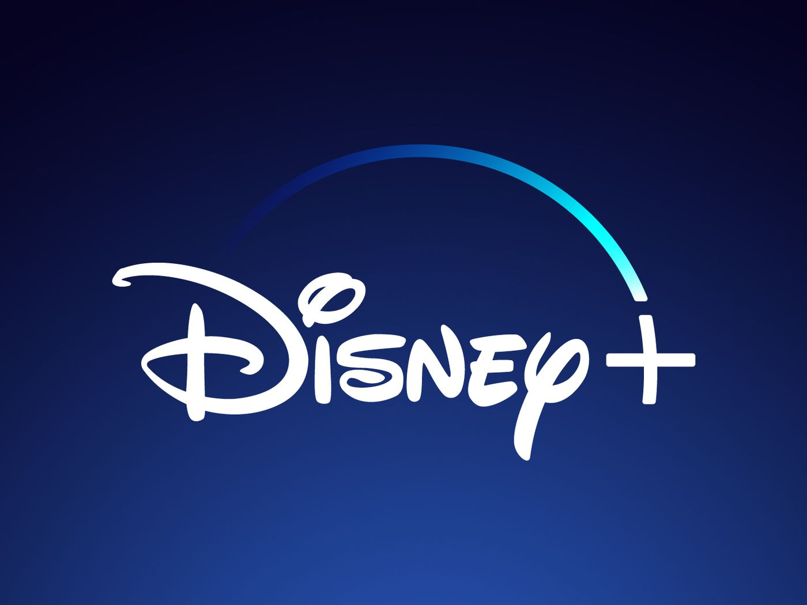

# 

# Disney+ Clone
 This isn't the official Disney+ site. I developed this site using my ReactJs skills to create the front-end and I used Firebase for the back-end.

## <a href="https://disneypclone.netlify.app" target="_blank">LIVE DEMO</a>

## Description
This is the ReactJS Disney Plus Clone, the perfect project to put on your portfolio.

## Build it today!

#### PREREQUISITES:
- Sign up for a Firebase account <a href='https://firebase.google.com'>HERE</a>
- Install Node JS in your computer <a href='https://nodejs.org/en/'>HERE</a>